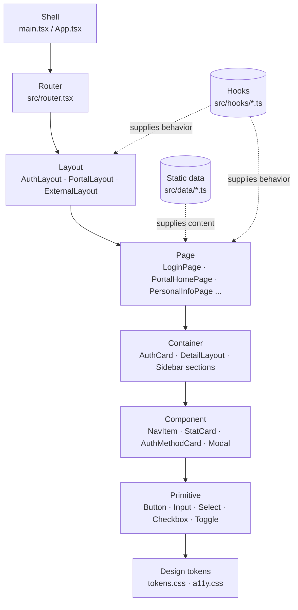

# SAP UI Architecture — Shell to Primitive

Every screen in `sap-web` resolves through the same tiers, top to bottom. This diagram shows that path, with a real example from the codebase at each stop.

## What each tier owns

Ordered from the outermost wrapper to the smallest styled unit. A tier only ever talks to its neighbors — a Page never reaches into another Page's Container, and no tier below Primitive holds routing or navigation.

| # | Tier | What it owns | Real example |
|---|------|---------------|---------------|
| 01 | **Shell** | Mounts the app once — provider stack, global stylesheet import, the router itself. | `src/main.tsx`, `src/App.tsx` |
| 02 | **Router** | Maps every URL to a Layout + Page pair. The only place route paths are declared. | `createBrowserRouter()` in `src/router.tsx` |
| 03 | **Layout** | The chrome shared by a whole section — header, sidebar, skip link — with an `<Outlet/>` for whichever Page is active. | `AuthLayout` · `PortalLayout` · `ExternalLayout` |
| 04 | **Page** | One screen, one route. Composes Containers and passes them whatever Data it needs. | `LoginPage` · `PortalHomePage` · `FinancialPage` |
| 05 | **Container** | A page-specific arrangement of Components — a form grid, a card shell, a sidebar's nav sections. Not reused outside its Page. | `AuthCard` · `DetailLayout` · Sidebar's section blocks |
| 06 | **Component** | A reusable, composite unit built from Primitives — has its own visual identity and sometimes local state (a modal's step, a group's open/closed). | `NavItem` · `StatCard` · `AuthMethodCard` · `Modal` · `VerifyCard` |
| 07 | **Primitive** | The smallest named unit — one form control or UI atom, styled once and used everywhere. | `Button` · `Input` · `Select` · `Checkbox` · `Toggle` · `Badge` |
| 08 | **Design tokens** | Color, spacing, and type values every tier above reads from — nothing here is a component. | `--blue-500`, `--sidebar-w`, `--header-h` in `tokens.css` |

## Cross-cutting layers

These feed into the chain above without being part of it — neither one is itself a tier a Page "contains."

- **Static data** (`src/data/*.ts` — `navigation.ts`, `portals.ts`, `authSettings.ts`, etc.) feeds Pages directly, bypassing Containers. Stands in for a future API response.
- **Hooks** (`src/hooks/*.ts` — `useMediaQuery`) supply shared behavior a Layout or Page pulls in without owning the logic itself.
