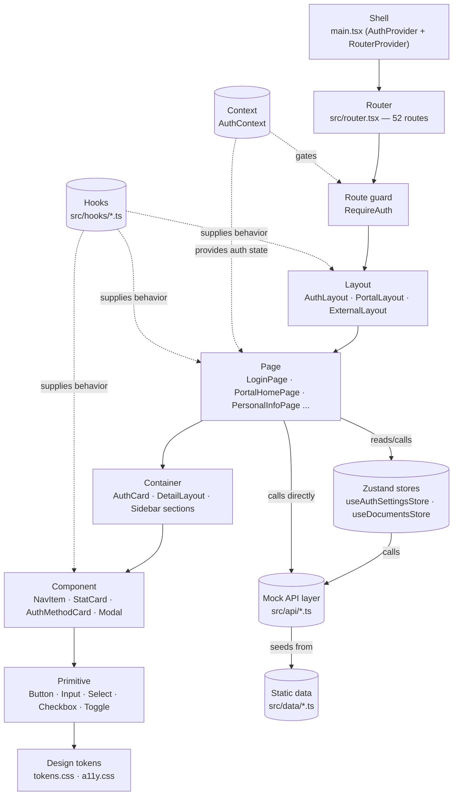

# SAP UI Architecture — Shell to Primitive

Every screen in `sap-web` resolves through the same tiers, top to bottom. This diagram shows that path, with a real example from the codebase at each stop.

## What each tier owns

Ordered from the outermost wrapper to the smallest styled unit. A tier only ever talks to its neighbors — a Page never reaches into another Page's Container, and no tier below Primitive holds routing or navigation.

| # | Tier | What it owns | Real example |
|---|------|---------------|---------------|
| 01 | **Shell** | Mounts the app once — provider stack, global stylesheet import, the router itself. | `src/main.tsx` (`AuthProvider` wrapping `RouterProvider`) |
| 02 | **Router** | Maps every URL to a Layout + Page pair. The only place route paths are declared. | `createBrowserRouter()` in `src/router.tsx` — 52 route entries |
| 02.5 | **Route guard** | Gates an entire route group on auth state, redirecting rather than rendering. Sits between Router and Layout, not a Layout itself. | `RequireAuth` — wraps the `PortalLayout`/`ExternalLayout` route groups |
| 03 | **Layout** | The chrome shared by a whole section — header, sidebar, skip link — with an `<Outlet/>` for whichever Page is active. | `AuthLayout` · `PortalLayout` · `ExternalLayout` |
| 04 | **Page** | One screen, one route. Composes Containers, calls into stores/the API layer, and passes data down. | `LoginPage` · `PortalHomePage` · `FinancialPage` |
| 05 | **Container** | A page-specific arrangement of Components — a form grid, a card shell, a sidebar's nav sections. Not reused outside its Page. | `AuthCard` · `DetailLayout` · Sidebar's section blocks |
| 06 | **Component** | A reusable, composite unit built from Primitives — has its own visual identity and sometimes local state (a modal's step, a group's open/closed). | `NavItem` · `StatCard` · `AuthMethodCard` · `Modal` · `UploadQueueItem` |
| 07 | **Primitive** | The smallest named unit — one form control or UI atom, styled once and used everywhere. | `Button` · `Input` · `Select` · `Checkbox` · `Toggle` · `Card` |
| 08 | **Design tokens** | Color, spacing, and type values every tier above reads from — nothing here is a component. | `--blue-500`, `--sidebar-w`, `--header-h` in `tokens.css` |

## Cross-cutting layers

These feed into the chain above without being part of it — neither one is itself a tier a Page "contains."

- **Context** (`src/context/` — `AuthContext.tsx`, `authContextInstance.ts`, `useAuth.ts`) holds the one piece of app-wide state that isn't page-local: whether the user is logged in. `RequireAuth` reads it to gate routes; `LoginPage`/`SignupPage` write to it on success; `logout()` also resets the mock API layer's session-scoped state (auth-method toggles, login lockout counters).
- **Zustand stores** (`src/stores/` — `useAuthSettingsStore`, `useDocumentsStore`) hold client-side state for the two domains complex enough to need it (23 toggleable auth methods, an uploadable document list), backed by the API layer below rather than holding data of their own.
- **Mock API layer** (`src/api/` — `client.ts`'s shared `request()` latency-simulator, plus one file per domain: `authApi`, `authSettingsApi`, `documentsApi`, `activityApi`, `notificationsApi`, `portalsApi`) stands in for a real backend. Every real user action funnels through here now — not just the two domains with a Zustand store above; Pages with simpler needs (Recent Activity, notifications, the portals catalog, login/signup) call an `api/*.ts` function directly via `useEffect`/`async` handlers instead of going through a store.
- **Static data** (`src/data/*.ts`) is the seed content each `api/*.ts` file's in-memory mock "database" is initialized from — it's no longer consumed directly by Pages the way it was before the wiring phase; the API layer sits between the two now.
- **Hooks** (`src/hooks/*.ts` — `useMediaQuery`, `useAuthMethodsSection`, `useFileUpload`, `useModalA11y`) supply shared behavior a Layout, Page, or Component pulls in without owning the logic itself.
